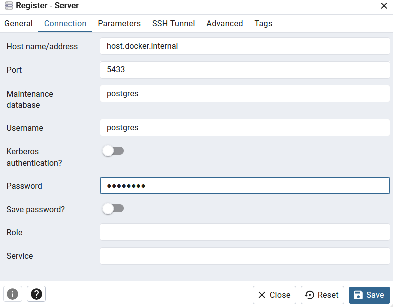

# Here you can find the description on how to run this dbt-airflow test project

## 1. The Dataset

The data I used is a dataset that simulates People team related issues raised by various teams.
The initial dataset is inserted to the external postgresDB during the container creation.
You can find the data in the raw_data schema in the issues_data table.

## 2. Setting Up Docker Containers

You can spin up the docker containers from the images specified in docker-compose.yml and Dockerfile files.

#### Build the images (you can omit `--no-cache` in case you don't want to re-build every layer)
$ docker compose build --no-cache

#### Run the containers
$ docker compose up

#### Once everything is tested please shut down the containers 
#### Shutdown the containers
$ docker compose down

## 3. Airflow

The Airflow Web UI is available on localhost:8080 .
The cosmos DAG (my_cosmos_dag) needs to be triggered manaully in order to run the dbt transformations.
There are 2 transformation layers:
- staging -> creates a table in the stg_data schema in the external postgresDB
- aggregation -> creates 3 views in the agg_data schema in the external postgresDB

## 4. PgAdmin

To inspect the successful data transformations in the external postgres database you can connect to pgAdmin on localhost:5050
In order to login use the following credentials:
email: postgres@postgres.com
password: postgres

After login you need to register the server. (Right click on the server icon -> register server)
You need to provide a name for your server and the connection parameters as follows:
- host name: host.docker.internal
- port: 5433
- username: postgres
- password: postgres

## What is missing???

Due to time limitation I was unable to create the documentation properly.

I've run the "dbt docs generate" command on my local machine but I've run into some UTF-8 encoding errors which I did not have enough time to debug so the docs files are created only partially (dags/dbt/target).

I've also added the AIRFLOW__COSMOS__DBT_DOCS_DIR environmental variable to the airflow compose file but for some reason in the Web UI on the Browse tab when I click on "dbt Docs" it returns a 404 error.
